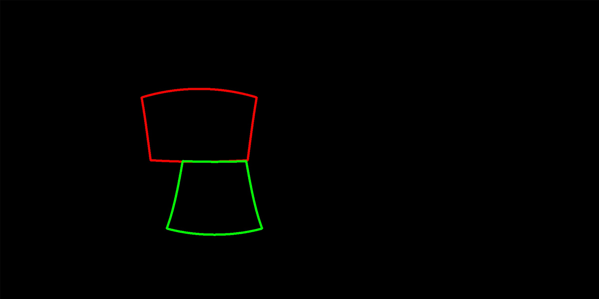
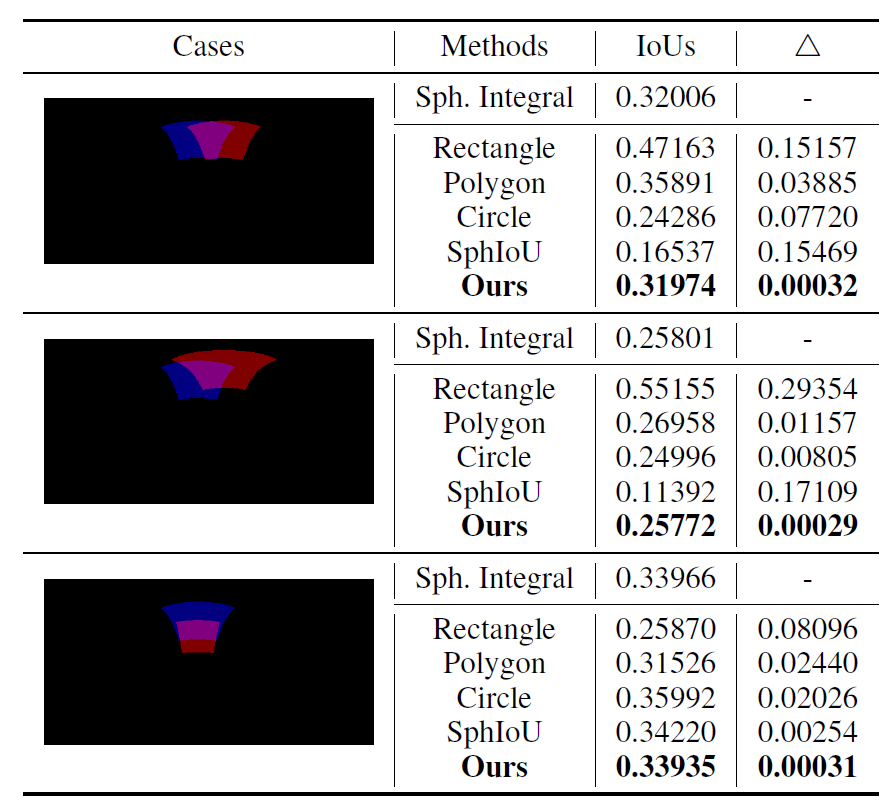

# Spherical Image Object Detection


# Unbiased Spherical IoU

**Unbiased IoU for Spherical Image Object Detection**<br>
Feng Dai, Bin Chen, Hang Xu, Yike Ma, Xiaodong Li, Bailan Feng, Peng Yuan, Chenggang Yan, Qiang Zhao*. AAAI, 2022. <br>
Paper Link:  [arXiv](https://arxiv.org/abs/2102.09480)  (This is an initial version of our paper, and a formal camera ready version with more details will be given after AAAI-22 conference.)


## Algorithms

Our **Unbiased spherical IoU** first calculate the area of each spherical rectangle. Then calculate the intersection area of the two spherical rectangles. Finally, we can get the spherical IoU.

**Firstly**, the area of each spherical rectangle can be computed by following formula (The derivation is given in the supplementary material in our paper)
$$
A(b_i) = 4\arccos(-\sin\frac{\alpha_i}{2}\sin\frac{\beta_i}{2}) - 2\pi, for \ i \in \{1, 2\}
$$
**Secondly**, the whole Intersection Area Computation Process (3 Steps):

- Step 1. Compute normal vectors and point vectors of each plane for eight boundaries of two spherical rectangles;

- Step 2. Remove unnecessary points by two Sub-steps:
  - Sub-step 1: Remove points outside the two spherical rectangles;
  - Sub-step 2: Remove redundant Points. (This step is not required for most cases that do not have redundant points.)

- Step 3. Compute all left angles and the final intersection area.

**Finally**, the spherical IoU is computed by the following formula
$$
IoU(b_1, b_2) = \frac{A(b_1 \cap b_2)}{A(b_1 \cup b_2)} = \frac{A(b_1 \cap b_2)}{A(b_1) + A(b_2) - A(b_1 \cap b_2)}
$$

## Examples

|  |  |  |
| :--------------------------------: | :--------------------------------: | :--------------------------------: |
|   *Example 1:*  IoU = 0.34272136   |   *Example 2:*  IoU = 0.58728738   |      *Example 3:*  IoU = 0.0       |
|  |  |  |
|   *Example 4:*  IoU = 0.00521955   |   *Example 5:*  IoU = 0.79667179   |   *Example 6:*  IoU = 0.00049333   |

* For Examples 1-3, as most cases, the IoU can be easily calculated by our algorithm without the loop-detection process in Sub-step 2 (Step 2) of the intersection area computation algorithm.
* For examples 4-6, these examples have at least 3 edges intersect at the same point, or even edges overlap. We need a loop detection algorithm to find the real points, which is a  process of finding a closed loop by DFS algorithm, but these cases are relatively few in evaluation or training. The computation cost is negligible. 

**Note:**  Due to the copyright restrictions and a few special cases, we just release the part of the computation process of our unbiased IoU (Key algorithms without loop detection). If you are interested in the unbiased IoU and want to use it in your research, please contact qiangzhao@ieee.com  for a complete code version of our unbiased IoU. 

## Comparisons with Existing Biased Methods



* The IoUs computed with different methods for three cases (Resolution: 1024 ×512). Here spherical integral by numerical integration is taken as the reference method. The differences are listed between each method and the reference method.
* Note that the spherical integral by numerical integration method will be degraded if we use unrolled spherical images with lower resolution. And it is also time-consuming, which takes 37.5ms for IoU calculation, while our method (Unbiased IoU) is much faster and only needs 0.99ms at the same resolution (1024 ×512).


## Prerequisites

- Python ≥ 3.6
- Numpy==1.16.5 ( We use this version  and other versions of Numpy Package may also be available.)
- Opencv-python == 4.5.1.48 (Optional. If you want to see the visualization results, please install this package.)

## Usage

Some examples are listed in the `main.py` (*pred* and *gt*), and execute this file to show the examples.

```python
python main.py
```

The iou computation matrix will be calculated and be showed in the command line.

Note that the format of the input spherical rectangle and the input of the function of our unbiased IoU is different, thus `transFormat` is used to change the format.

```python
The input format for pred and gt (angles)
    [center_x, center_y, fov_x, fov_y]
        center_x : [-180, 180]
        center_y : [90, -90]
        fov_x    : [0, 180]
        fov_y    : [0, 180]
The input format for our unbiased IoU: (radians)
	[center_x, center_y, fov_x, fov_y]
        center_x : [0, 360]
        center_y : [0, 180]
        fov_x    : [0, 180]
        fov_y    : [0, 180]
```

If you do not want to see the visualization of the spherical rectangles, remove the call of the function `drawSphBBox`.

<!-- ## Citing Our Work -->

## Citing the Unbiased Spherical IoU

If you use our Unbiased IoU in your research or wish to refer to the results published in the paper, please use the following BibTeX entry.

```BibTeX
@inproceedings{SphIoU,
  title={Unbiased IoU for Spherical Image Object Detection},
  author={Dai, Feng and Chen, Bin and Xu, Hang and Ma, Yike and Li, Xiaodong and Feng, Bailan and Yan, Chenggang and Zhao, Qiang},
  booktitle={Proceedings of AAAI Conference on Artificial Intelligence},
  year={2022}
}
```
